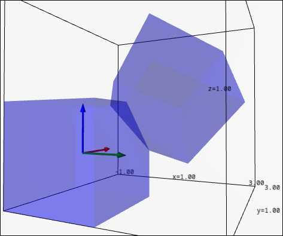
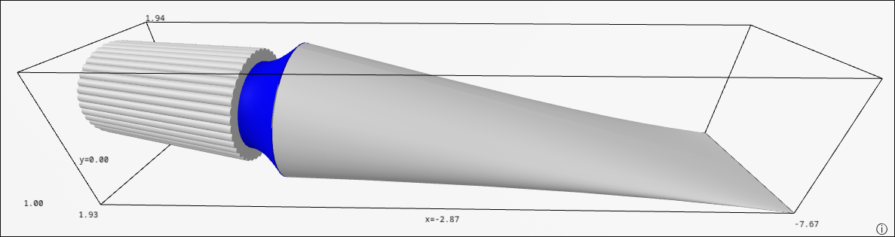
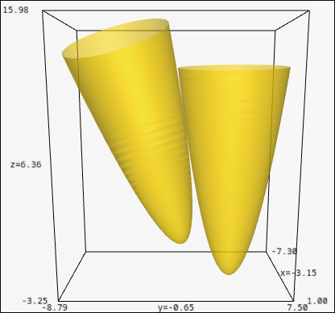

## Lab1 — Affine Transformations

First contact with affine transformations and matrix multiplication: rotating, scaling and translating objects in 3D by composing transformation matrices. The final exercise consists of building cubes and positioning them at specific coordinates purely through matrix math.

Qualification: 9,00/10,00

Feedback comments -> All good except that you used some dots products (angles) in the last exercise that were not really needed.

## Lab2 — Parametric Surfaces

Introduction to defining and drawing objects using parametric surfaces. The final exercise is a toothpaste tube, modeled and rendered entirely from parametric equations.

Qualification: 10,00/10,00

## Lab3 — Quaternions and Rotations

Using quaternions and Rodrigues' rotation formula to model rigid-body rotations. The final exercise renders two champagne glasses at the exact moment of a toast, touching at a single point, with their orientation computed via Rodrigues' formula.

Qualification: 10,00/10,00

## Exercise Presentation

Qualification: 2,00/2,00
